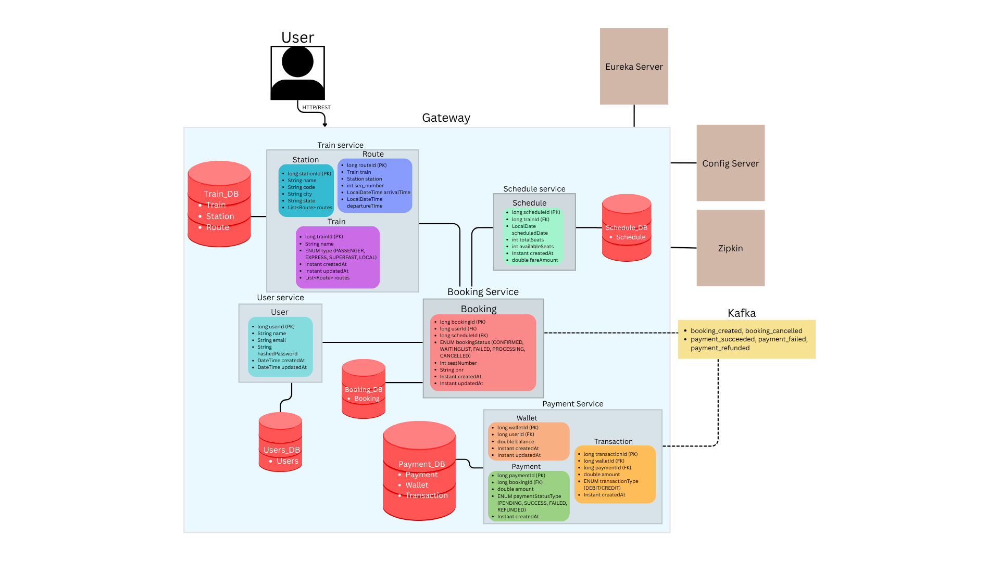
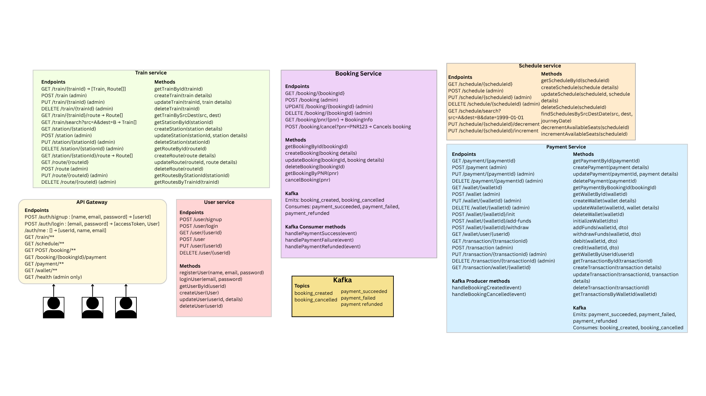

# 🚂 Platform-One: A Train Booking System


Platform-One is a complete, end-to-end microservices application for a railway booking platform. It is built entirely on
the Spring ecosystem, containerized with Docker, and fully orchestrated on Kubernetes.

This project is a showcase of modern cloud-native design principles, including service discovery, centralized
configuration, distributed tracing, security, event-driven architecture, and resilience patterns.

## Core Features

- **Full Microservice Architecture:** The system is broken down into independent, domain-driven services (User, Train,
  Schedule, Payment, Booking).

- **Centralized API Gateway:** A single entry point (`gateway`) handles all client requests, routing, rate
  limiting, and coarse-grained security.

- **Service Discovery & Config:** Uses Spring Cloud Eureka for service registration/discovery and a Spring Cloud Config
  Server (backed by Git) for centralized, dynamic configuration.

- **Comprehensive Security Model:**

    - End-User Auth: Stateless JWT (JSON Web Token) authentication for all user-facing endpoints.

    - Service-to-Service Auth: Secure Feign calls using both forwarded user JWTs and a private `X-Internal-API-Key` for
      system-to-system communication (e.g., during sign-up).

- **Event-Driven Architecture:** Uses Kafka for asynchronous communication between services (e.g., booking failures
  triggering
  schedule updates) to ensure loose coupling and resilience.

- **Containerized & Orchestrated:** Every service has a multi-stage `Dockerfile` for a lightweight build. The entire
  platform is
  deployed on Kubernetes using a full set of manifests (Secrets, ConfigMaps, Deployments, Services).

- **Observability:** Integrated with Zipkin for distributed tracing to monitor requests as they flow across services.

- **Resilience & Caching:** Uses Redis for rate limiting at the gateway.

- **Persistent & Tested:** Uses PostgreSQL for all persistent data (with H2 for unit/integration tests). The project
  includes
  a robust test suite using `@WebMvcTest`, `@DataJpaTest`, and `@SpringBootTest` with Mockito.

## Architecture Diagrams

The system was designed following a domain-driven, event-based approach.

**High-Level Design (HLD)** - This diagram shows the overall system components, services, and their primary
interactions.


**Component Diagram** - This shows the key components within the system and their dependencies.


**Sequence Diagram** - This diagram details the flow of a core user story, such as a user booking a ticket, showing the
call sequence across microservices.


**Low-Level Design (LLD)** - This provides a more detailed look at the internal structure of a specific service or
domain.


## Architecture & Services

The platform is composed of the following services, which run in Docker or as Kubernetes pods.

### Infrastructure & Management

- **Config Server** (`config-server`): Centralized configuration management. Serves properties from a Git repository.

- **Eureka Server** (`eureka-server`): Handles service discovery and registration. All microservices register themselves
  here.

- **API Gateway** (`gateway`): The single entry point for all clients. Handles request routing, rate limiting (Redis),
  and global security filters.

### Core Microservices

- **User Service** (`user`): Manages user registration (/auth/signup), login (/auth/signin), profiles, and roles (USER,
  ADMIN). Issues JWTs.

- **Train Service** (`train`): Manages all train, route, and station data.

- **Schedule Service** (`schedule`): Manages the train schedules, including seat availability.

- **Payment Service** (`payment`): Manages user wallets and payment transactions. Listens for booking events from Kafka.

- **Booking Service** (`booking`): Handles the core booking logic. Communicates with the Schedule, Train, and Payment
  services to create a booking.

### Backing Services (Platform)

- **PostgreSQL** (`postgres`): Primary relational database for all microservices (each with its own schema/database).

- **Kafka** (`kafka`) / **Zookeeper** (`zookeeper`): Message broker for asynchronous, event-driven communication.

- **Redis** (`redis`): In-memory data store used by the Gateway for rate limiting.

- **Zipkin** (`zipkin`): Distributed tracing server.

## 🚀 Getting Started (How to Run)

You can run the entire platform using either Docker Compose (for development) or Kubernetes (for production).

#### Prerequisites

- Java 24+
- Maven 3.9+
- Docker & Docker Compose
- `kubectl` and a Kubernetes cluster (e.g., Docker Desktop's built-in Kubernetes)

---

### Option 1: Run with Docker Compose (Recommended for Dev)

1. **Build All Images:** From each microservice directory (e.g., `user/`, `gateway/`, etc.), build the Docker image
   using the `Dockerfile` and tag it with the name used in `docker-compose.yaml`.

```Bash
# Example for user (run from its directory)
docker build -t hanessn/platformone-user:01 .

# Example for gateway (run from its directory)
docker build -t hanessn/platformone-gateway:01 .

# ...repeat for all services
```

2. Update Git Config (If Needed): Ensure the config-server's application.properties (or your compose file) points to the
   correct Git repository containing your configuration files.
3. Launch! From the root of the project (where docker-compose.yml is located):

```Bash
docker-compose up -d
```

4. Access the System:

- Gateway: http://localhost:8085
- Eureka Dashboard: http://localhost:8761
- Config Server: http://localhost:8888
- Zipkin: http://localhost:9411
- PgAdmin: http://localhost:5050

### Option 2: Run on Kubernetes (Production)

This guide assumes your Docker images (e.g., hanessn/platformone-user:01) have been pushed to Docker Hub.

1. Check Your k8s/ Files: Ensure all ConfigMap and Secret files in k8s/ have the correct settings.
2. Apply Manifests in Order: It is critical to apply these in order, as services depend on the platform and config
   layers.

```bash
# 1. Create all secrets
kubectl apply -f k8s/99-secrets/

# 2. Deploy the entire backing platform
kubectl apply -f k8s/00-platform/

# 3. Wait for Postgres, Kafka, and Redis to be 'Running'
kubectl get pods -w

# 4. Deploy the config/registry layer
kubectl apply -f k8s/01-config-registry/

# 5. Wait for Eureka and Config Server to be 'Running'
kubectl get pods -w

# 6. Deploy your business services
kubectl apply -f k8s/02-services/

# 7. Deploy the Gateway (the front door)
kubectl apply -f k8s/03-gateway/
```

3. Find Your External IP: Run the following command and look for the EXTERNAL-IP of the gateway. (This may take
   a minute to be assigned by your K8s provider).

```bash
kubectl get service gateway
```

You can now access your application at `http://<EXTERNAL-IP>:8085`

---

## Technology Stack

| Category      | Technology                                                                   |
|---------------|------------------------------------------------------------------------------|
| Backend       | 	Spring Boot, Spring Cloud (Gateway, Config, Eureka, Feign), Spring Data JPA |
| Security      | 	Spring Security 6, JWT, @PreAuthorize                                       |
| Data          | 	PostgreSQL, Redis, H2 (for tests)                                           |
| Messaging     | 	Apache Kafka                                                                |
| DevOps        | 	Docker, Docker Compose, Kubernetes                                          |
| Observability | 	Zipkin, Spring Boot Actuator, Prometheus, Grafana                           |
| Testing       | 	JUnit 5, Mockito, @WebMvcTest, @DataJpaTest, @SpringBootTest                |

## Security Model

- **Gateway** (`AuthGlobalFilter`): Acts as the first line of defense. It rejects any request to a secured path that is
  missing a token (401). It also performs coarse-grained validation.
- **Microservices** (`JwtAuthenticationFilter`): Each service is responsible for its own security. It independently
  validates
  the JWT's signature and claims (e.g., roles) on every request it receives.
- **Service-to-Service:**
    1. User Token Forwarding: The `FeignAuthInterceptor` automatically forwards the user's JWT from the incoming request
       to any downstream Feign calls.
    2. Internal System Token: For calls initiated by the system (like `signup` creating a wallet), the
       `FeignAuthInterceptor` sends a secret `X-Internal-API-Key` instead. An InternalApiAuthFilter in the receiving
       service
       validates this key and grants `ROLE_INTERNAL_SERVICE`.

## Configuration Management

All configuration is externalized using Spring Cloud Config.

- The Config Server reads from this Git Repository.
- The `config/` directory contains properties for each service (e.g., user.properties).
- Profile-specific files (e.g., user-docker.properties) override the defaults when the docker profile is active,
  allowing the same application image to run locally (with localhost) or in Kubernetes (with container names like
  postgres).